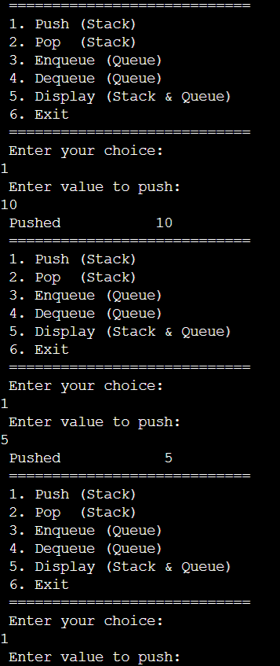

# Stack and Queue Implementation in Fortran

## 📌 Overview
This project demonstrates a simple **Stack** and **Queue** implementation in **Fortran**.  
It supports the following operations:

- **Stack**  
  - Push (insert element)  
  - Pop (remove element)  
  - Display current stack  

- **Queue**  
  - Enqueue (insert element)  
  - Dequeue (remove element)  
  - Display current queue  

The program is **menu-driven** and uses arrays with a fixed maximum size (`maxsize = 10`).

---

## 🛠 Features
- Stack operations (`push`, `pop`, `display`)
- Queue operations (`enqueue`, `dequeue`, `display`)
- Menu-driven interface
- Error handling for **overflow** and **underflow**

---

## ▶️ How to Run

### Option 1: Run Online
You can run the program directly on these sites:
- [OnlineGDB Fortran Compiler](https://www.onlinegdb.com/online_fortran_compiler)  
- [TutorialsPoint Fortran Online Compiler](https://www.tutorialspoint.com/compile_fortran_online.php)  
- [JDoodle Fortran Compiler](https://www.jdoodle.com/execute-fortran-online/)

Just paste the code and run!

---

### Option 2: Run Locally

1. Install **gfortran**:
   - **Ubuntu/Debian**:
     ```bash
     sudo apt install gfortran
     ```
   - **Windows**: Install via [MinGW-w64](http://mingw-w64.org).
   - **Mac**: Use Homebrew:
     ```bash
     brew install gcc
     ```

2. Save the program as `stack_queue.f90`.

3. Compile and run:
   ```bash
   gfortran stack_queue.f90 -o stack_queue
   ./stack_queue
   ```

---

## 📂 Example Usage
```
============================
1. Push (Stack)
2. Pop  (Stack)
3. Enqueue (Queue)
4. Dequeue (Queue)
5. Display (Stack & Queue)
6. Exit
============================
Enter your choice:
```

---

## 👨‍💻 Author
- Written in **Fortran 90**
- Example program for **Data Structures (Stack & Queue)**

## Screenshot

